# Periscope Dashboard — Architecture

## High-Level Architecture

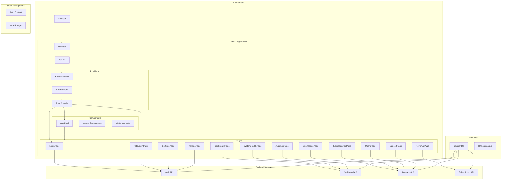

## Component Hierarchy

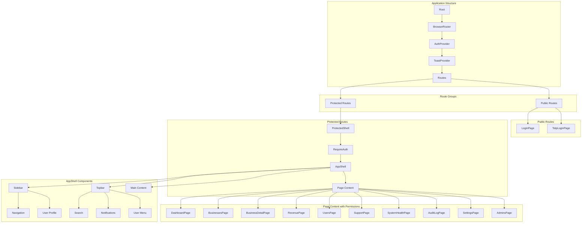

## Data Flow

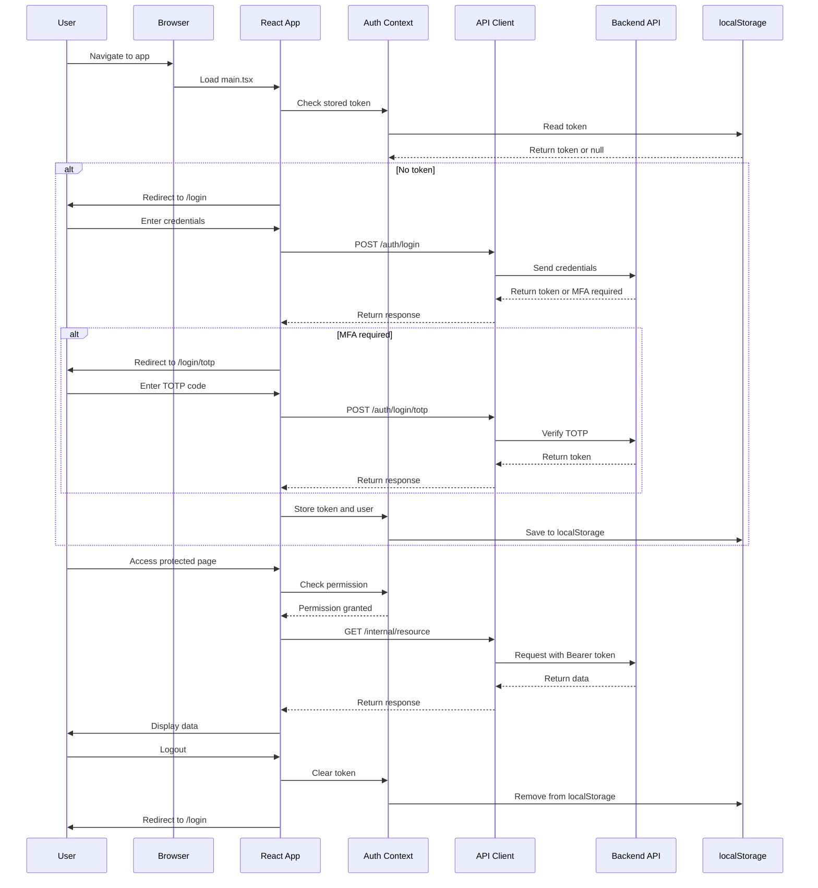

## API Layer Architecture

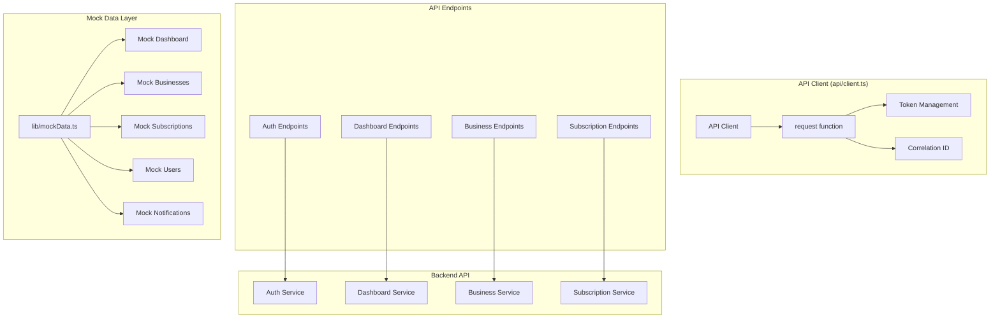

## State Management

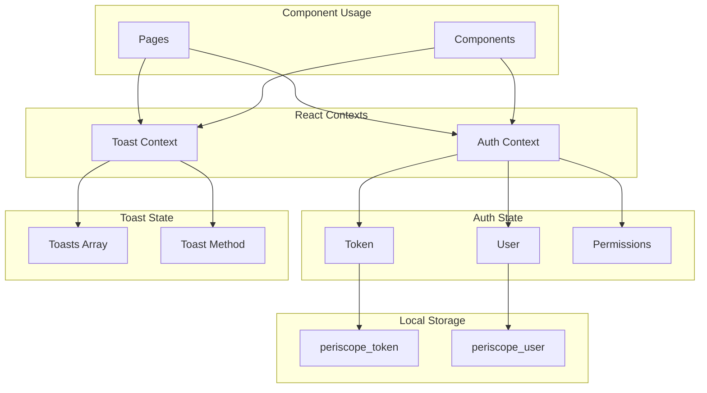

## Routing & Permissions

```mermaid
graph TB
    subgraph "Route Definitions"
        Root[/: Root]
        Login[/login]
        TotpLogin[/login/totp]
        Dashboard[/dashboard]
        Businesses[/businesses]
        BusinessDetail[/businesses/:id]
        Revenue[/revenue]
        Subscriptions[/subscriptions]
        Users[/users]
        Support[/support]
        SystemHealth[/system-health]
        AuditLog[/audit-log]
        Settings[/settings]
        Admins[/settings/admins]
    end

    subgraph "Permission Requirements"
        SystemRead[system.read]
        BusinessRead[business.read]
        BillingRead[billing.read]
        SubscriptionRead[subscription.read]
        UserRead[user.read]
        SupportRead[support.read]
        SystemWrite[system.write]
    end

    subgraph "Route Permissions"
        Dashboard --> SystemRead
        Revenue --> BillingRead
        Subscriptions --> SubscriptionRead
        Users --> UserRead
        Support --> SupportRead
        SystemHealth --> SystemRead
        AuditLog --> SystemRead
        Admins --> SystemWrite
    end

    subgraph "Auth Flow"
        Root --> Login
        Root --> TotpLogin
        Login --> Dashboard
        TotpLogin --> Dashboard
        Dashboard --> Businesses
        Dashboard --> BusinessDetail
        Dashboard --> Revenue
        Dashboard --> Subscriptions
        Dashboard --> Users
        Dashboard --> Support
        Dashboard --> SystemHealth
        Dashboard --> AuditLog
        Dashboard --> Settings
        Settings --> Admins
    end
```

## Component Structure

```mermaid
graph TB
    subgraph "UI Components"
        KpiCard[KpiCard]
        StatusBadge[StatusBadge]
        AppTag[AppTag]
        Skeleton[Skeleton]
        OtpInput[OtpInput]
        Toast[Toast]
    end

    subgraph "Layout Components"
        AppShell[AppShell]
        Sidebar[Sidebar]
        Topbar[Topbar]
        MainContent[Main Content]
    end

    subgraph "Page Components"
        LoginPage[LoginPage]
        TotpLoginPage[TotpLoginPage]
        DashboardPage[DashboardPage]
        BusinessesPage[BusinessesPage]
        BusinessDetailPage[BusinessDetailPage]
        RevenuePage[RevenuePage]
        UsersPage[UsersPage]
        SupportPage[SupportPage]
        SystemHealthPage[SystemHealthPage]
        AuditLogPage[AuditLogPage]
        SettingsPage[SettingsPage]
        AdminsPage[AdminsPage]
        ErrorPages[Error Pages]
    end

    subgraph "Hook Components"
        UseAuth[useAuth]
    end

    subgraph "Type Definitions"
        Types[TypeScript Types]
    end

    AppShell --> Sidebar
    AppShell --> Topbar
    AppShell --> MainContent
    Sidebar --> Navigation
    Topbar --> Search
    Topbar --> Notifications
    Topbar --> UserMenu
    MainContent --> PageContent

    LoginPage --> UseAuth
    TotpLoginPage --> UseAuth
    DashboardPage --> KpiCard
    BusinessesPage --> StatusBadge
    BusinessDetailPage --> StatusBadge
    RevenuePage --> KpiCard
    UsersPage --> StatusBadge
    SupportPage --> StatusBadge
    SystemHealthPage --> KpiCard
    AuditLogPage --> StatusBadge
    SettingsPage --> OtpInput
    AdminsPage --> StatusBadge
    ErrorPages --> StatusBadge

    AllComponents --> Types
```

## Tech Stack

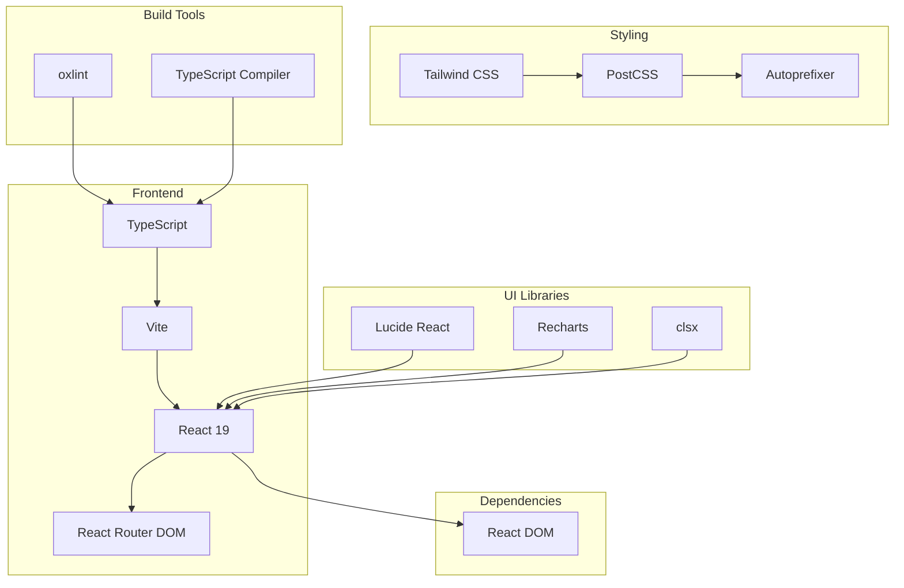

## Data Models

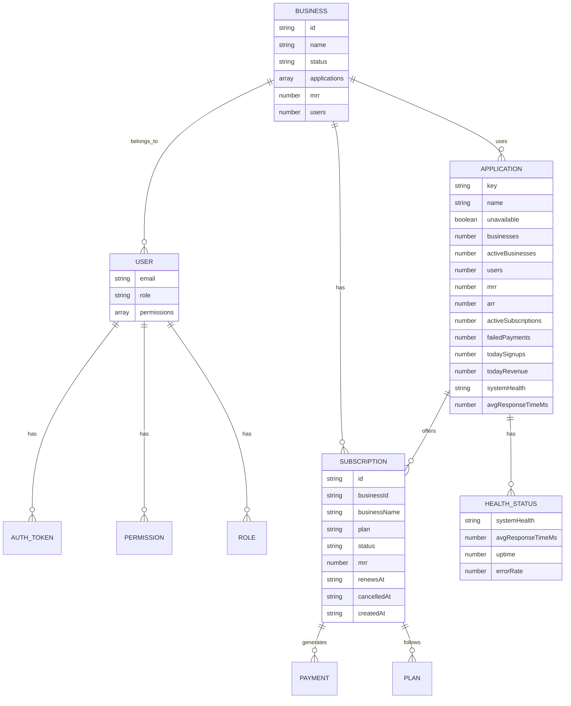

## Deployment Architecture

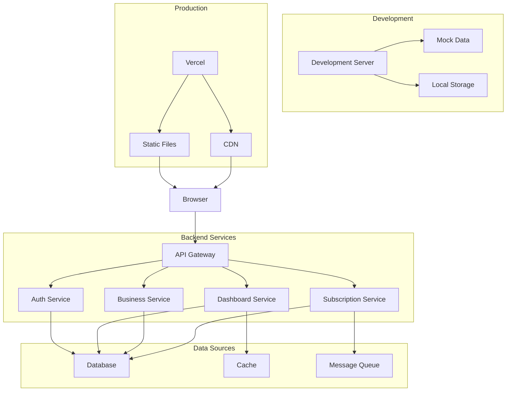

## Error Handling Flow

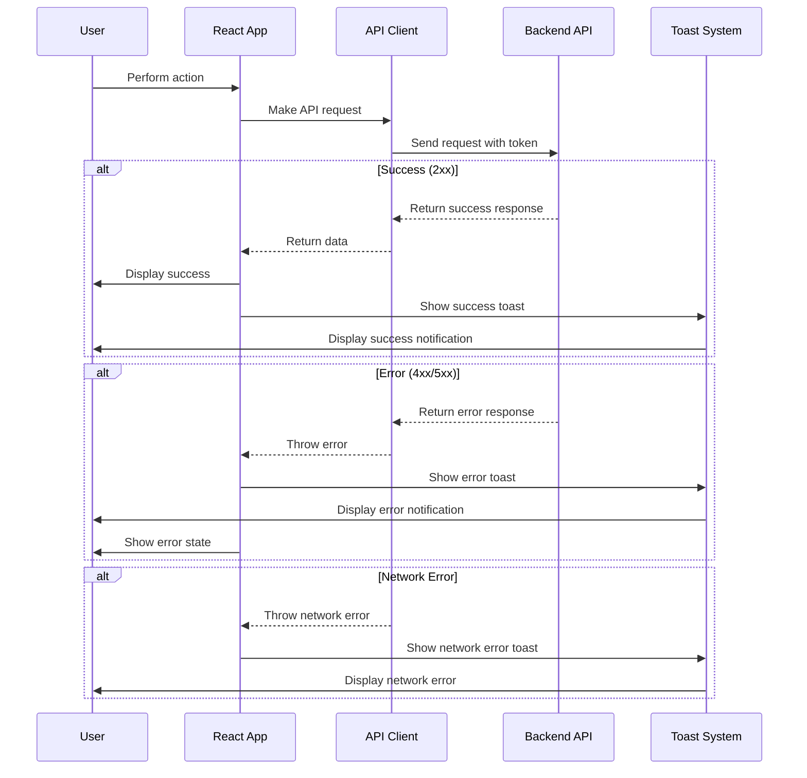

## Authentication Flow

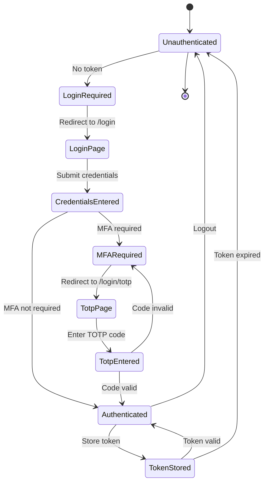

## Permission Matrix

```mermaid
graph TB
    subgraph "Roles"
        SuperAdmin[Super Admin]
        Support[Support]
        Sales[Sales]
    end

    subgraph "Permissions"
        BusinessRead[business.read]
        BusinessWrite[business.write]
        BusinessDelete[business.delete]
        UserRead[user.read]
        UserWrite[user.write]
        BillingRead[billing.read]
        BillingWrite[billing.write]
        SubscriptionRead[subscription.read]
        CustomerRead[customer.read]
        SupportRead[support.read]
        SupportWrite[support.write]
        SystemRead[system.read]
        SystemWrite[system.write]
    end

    subgraph "Role Permissions"
        SuperAdmin --> BusinessRead
        SuperAdmin --> BusinessWrite
        SuperAdmin --> BusinessDelete
        SuperAdmin --> UserRead
        SuperAdmin --> UserWrite
        SuperAdmin --> BillingRead
        SuperAdmin --> BillingWrite
        SuperAdmin --> SubscriptionRead
        SuperAdmin --> CustomerRead
        SuperAdmin --> SupportRead
        SuperAdmin --> SupportWrite
        SuperAdmin --> SystemRead
        SuperAdmin --> SystemWrite

        Support --> BusinessRead
        Support --> UserRead
        Support --> SupportRead
        Support --> SupportWrite

        Sales --> BusinessRead
        Sales --> SubscriptionRead
        Sales --> BillingRead
        Sales --> CustomerRead
    end
```

## Summary

The Periscope Dashboard is a **React 19** single-page application built with **TypeScript** and **Vite**. It uses **React Router DOM** for client-side routing with **role-based access control (RBAC)**. The application follows a **component-based architecture** with:

- **Context-based state management** for authentication and toast notifications
- **API client layer** for backend communication with mock data support
- **Responsive design** using **Tailwind CSS** with a mobile-first approach
- **Permission-based routing** with protected routes and role-based access control
- **Modular component structure** with reusable UI components and layout components

The architecture supports both **development** (with mock data) and **production** (with real backend APIs) environments, making it scalable and maintainable for internal operations management.
